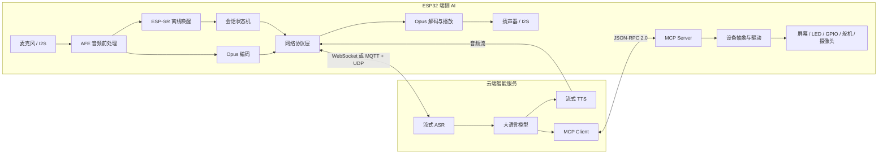

<div align="center">

# PhoneBed XiaoZhi

### 面向端侧 AI 的 ESP32 智能语音交互终端

离线感知 · 实时音频 · 边云协同 · MCP 设备控制

[](https://github.com/espressif/esp-idf)
[](https://isocpp.org/)
[](https://www.espressif.com/)
[](LICENSE)

</div>

## 项目概述

PhoneBed XiaoZhi 是运行在 ESP32 系列芯片上的嵌入式 AI 交互终端。项目以语音为入口，在资源受限的 MCU 上完成离线唤醒、音频前处理、实时编解码、会话状态管理与设备控制，并通过 WebSocket 或 MQTT + UDP 接入云端 ASR、LLM、TTS，形成完整的端云协同链路。

项目关注的不是简单调用大模型 API，而是如何把 AI 可靠地落到真实硬件：端侧负责低时延感知与确定性执行，云侧负责计算密集型语义推理；MCP（Model Context Protocol）把扬声器、屏幕、LED、GPIO、舵机和摄像头等能力抽象为大模型可发现、可调用的工具。

> **项目定位：** 面向智能家居、陪伴设备、桌面终端与具身交互原型的端侧 AI 基础平台。

## 技术亮点

| 方向 | 实现 | 工程价值 |
| --- | --- | --- |
| 端侧智能感知 | ESP-SR / WakeNet 离线唤醒、AFE、自定义唤醒词 | 降低唤醒时延与持续上传音频带来的隐私风险 |
| 实时语音链路 | I2S 采集、Opus 编解码、流式传输与播放队列 | 适配 MCU 算力、内存和带宽约束 |
| 边云协同 | 端侧感知与执行，云侧 ASR + LLM + TTS | 平衡响应速度、模型能力与硬件成本 |
| 设备智能体 | MCP Server、JSON-RPC 2.0、动态工具发现 | 将物理能力转化为 LLM 可调用工具 |
| 嵌入式架构 | FreeRTOS 任务、事件组、消息队列、状态机 | 解耦音频、网络、交互与外设控制 |
| 多硬件适配 | Board、Codec、Display、LED、Network 分层 | 支持多款 ESP32 芯片与开发板迁移 |
| 产品化能力 | Wi-Fi / Cat.1 4G、OTA、资源分区、多语言 | 覆盖设备连接、升级和资源管理 |

## 系统架构



### 端云职责边界

- **端侧：** 离线唤醒、音频前处理、编解码、交互状态机、UI 渲染、MCP 工具执行、外设控制与 OTA。
- **云侧：** 流式语音识别、大模型推理、语音合成及云端工具扩展。
- **协同层：** 结构化传输音频、会话事件与工具调用，解耦语义决策和物理执行。

## 核心交互链路

```text
语音输入
  → 端侧 AFE / 离线唤醒
  → PCM 分帧与 Opus 压缩
  → WebSocket 或 MQTT + UDP
  → 云端 ASR → LLM → TTS
  → 音频流下发与端侧播放
  → LLM 按需通过 MCP 调用设备工具
  → ESP32 执行硬件动作并返回结果
```

音频采集/播放与 Opus 编解码由独立任务处理，任务间通过队列传递压缩音频包。应用层状态机统一管理空闲、连接、聆听、说话等状态，并处理唤醒、语音打断、断线重连和升级事件。

## 技术栈

| 层级 | 技术与组件 |
| --- | --- |
| 芯片平台 | ESP32、ESP32-C3/C5/C6/S3/P4 |
| SDK / RTOS | ESP-IDF 5.4+、FreeRTOS、ESP Event、NVS、OTA |
| 开发语言 | C++、C、CMake、Python |
| 端侧 AI | ESP-SR、WakeNet、AFE、自定义唤醒词模型 |
| 音频系统 | I2S、ESP Audio Codec、Opus、重采样、AEC/NS |
| 网络连接 | Wi-Fi、ML307 Cat.1 4G、WebSocket、MQTT、UDP、TLS |
| Agent 协议 | MCP、JSON-RPC 2.0、Tool Schema、工具调用回传 |
| 图形交互 | LVGL 9、OLED/LCD/AMOLED、Emoji/GIF/JPEG、触摸 |
| 工程体系 | Component Manager、Kconfig、GitHub Actions、资源打包 |

## 代码导览

| 路径 | 作用 | 关注点 |
| --- | --- | --- |
| [`main/application.cc`](main/application.cc) | 应用主流程与事件调度 | 会话生命周期、唤醒、打断 |
| [`main/device_state_machine.cc`](main/device_state_machine.cc) | 设备状态机 | 状态转换与模块协同 |
| [`main/audio/`](main/audio/) | 音频服务与唤醒 | 实时任务、Opus、AFE、WakeNet |
| [`main/protocols/`](main/protocols/) | 通信协议抽象 | WebSocket 与 MQTT + UDP |
| [`main/mcp_server.cc`](main/mcp_server.cc) | 设备侧 MCP Server | 工具注册、发现、校验和调用 |
| [`main/boards/`](main/boards/) | 多开发板适配层 | 引脚、Codec、屏幕、按键、供电 |
| [`main/display/`](main/display/) | 图形与表情显示 | LVGL 渲染及图像资源 |
| [`main/ota.cc`](main/ota.cc) | 固件升级 | 下载、校验和升级流程 |

## MCP：让大模型操作真实设备

项目在 ESP32 内实现 MCP Server。云端建立连接后依次使用 `initialize` 协商能力、`tools/list` 获取工具及输入 Schema，再通过 `tools/call` 调用具体硬件能力。

典型工具包括读取设备状态、调节扬声器音量，以及由不同硬件扩展的 LED、GPIO、舵机和摄像头控制。LLM 只负责选择工具并生成参数，端侧负责参数边界检查和确定性执行。详见 [MCP 交互流程](docs/mcp-protocol.md) 与 [MCP 设备控制](docs/mcp-usage.md)。

## 快速构建

### 环境要求

- ESP-IDF 5.4 或更高版本
- Git、CMake、Ninja 与 Python
- 受支持的 ESP32 开发板及对应音频外设

### 编译与烧录

```bash
git clone https://github.com/qll070226-a11y/phonebed-xiaozhi.git
cd phonebed-xiaozhi

# 以 ESP32-S3 为例
idf.py set-target esp32s3
idf.py menuconfig
idf.py build
idf.py -p <PORT> flash monitor
```

在 `menuconfig` 中选择实际板型、唤醒词与功能。首次启动后，设备按所选板型进入网络配置流程。

> v2 使用新的分区布局，不能从 v1 直接 OTA 升级；已有 v1 设备需手动烧录。详见 [分区说明](partitions/v2/README.md)。

## 功能演示

1. **离线唤醒：** 验证无云端推理参与时，端侧仍能识别唤醒词；
2. **流式对话：** 展示说话、识别、生成、播放及语音打断的完整链路；
3. **设备控制：** 用自然语言触发 MCP 工具，控制音量、灯光或其他外设；
4. **实时架构：** 结合串口日志说明状态机、音频队列与网络会话变化；
5. **多板适配：** 对比不同 Board 配置，说明硬件抽象和迁移方式。

## 可继续研究的方向

- 轻量模型量化、剪枝与端侧推理性能评估；
- 端到端时延、内存、功耗及网络抖动的系统测量；
- 复杂声场下的回声消除、降噪与远场唤醒；
- 基于 MCP 的多模态传感器接入与具身控制；
- 弱网降级、本地缓存和隐私保护策略。

## 文档索引

- [自定义开发板](docs/custom-board.md)
- [WebSocket 协议](docs/websocket.md)
- [MQTT + UDP 协议](docs/mqtt-udp.md)
- [MCP 交互流程](docs/mcp-protocol.md)
- [音频模块说明](main/audio/README.md)

## 开源说明

本仓库基于开源项目 [78/xiaozhi-esp32](https://github.com/78/xiaozhi-esp32) 进行学习、整理与工程化展示，感谢原作者及社区贡献者。项目遵循 [MIT License](LICENSE)，使用或二次开发时请保留原始许可证和版权声明。

---

<div align="center">
面向真实硬件构建可感知、可交互、可执行的端侧 AI 终端
</div>
